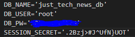

  # Just Tech News

  ## Description
  Just Tech New is sort of a reddit-lite application. It is a platform for link sharing where users can sign up, sign in, make changes and delete existing posts, create new posts, comment, and like posts.

  ## Table of Contents
  - [Install](#installation-instructions)
  - [Contributing](#contributing)
  - [Questions](#questions) 

  ## Installation Instructions
  1. Download repo zip.
2. Install Node.JS and MySQL.
3. Add a .env file to your repo with the below fields entered.  

4. Open command prompt to porject directory.
5. Run `mysql -u root -p`.
6. After you enter you password, run `source db/schema.sql`.
7. Type `exit` to leave mysql.
8. Run `npm i`.
9. To start the server run `npm start`.
10. You are ready to use you new site!

  ## Contributing
  This project is not open to contribution.

  ## Deployed
  [Click to View Deployment!](https://just-tech-news-verbaldye.herokuapp.com/)

  ## Questions?
  If you have any more questions for me, I can be reached from one of the links below. Thank you!
  - [Email Me!](mailto:dhunts258@gmail.com)
  - [Visit me on Github!](https://github.com/verbaldye)
